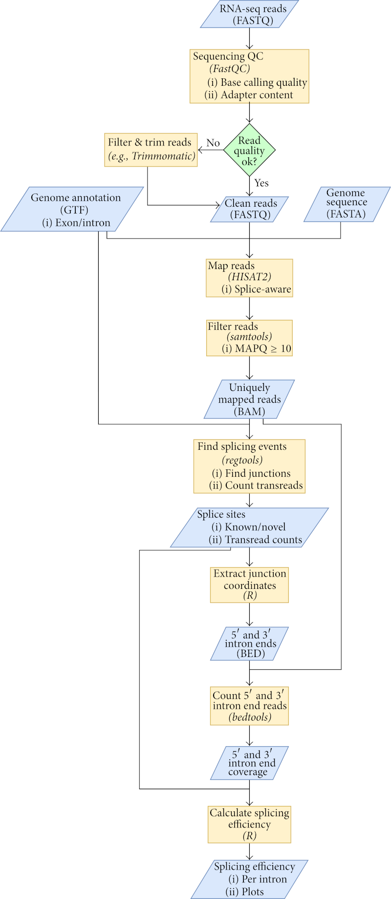

# splicing_efficiency
Scripts for the manuscript 

**Workflow for Genome-Wide Determination of Pre-mRNA Splicing Efficiency from Yeast RNA-seq Data.**

Převorovský M, Hálová M, Abrhámová K, Libus J, Folk P.

Biomed Res Int. 2016;2016:4783841. doi: 10.1155/2016/4783841. Epub 2016 Dec 6. PMID: 28050562 

https://www.hindawi.com/journals/bmri/2016/4783841/

Pre-mRNA splicing represents an important regulatory layer of eukaryotic gene expression. In the simple budding yeast Saccharomyces cerevisiae, about one-third of all mRNA molecules undergo splicing, and splicing efficiency is tightly regulated, for example, during meiotic differentiation. *S. cerevisiae* features a streamlined, evolutionarily highly conserved splicing machinery and serves as a favourite model for studies of various aspects of splicing. RNA-seq represents a robust, versatile, and affordable technique for transcriptome interrogation, which can also be used to study splicing efficiency. However, convenient bioinformatics tools for the analysis of splicing efficiency from yeast RNA-seq data are lacking. We present a complete workflow for the calculation of genome-wide splicing efficiency in *S. cerevisiae* using strand-specific RNA-seq data. Our pipeline takes sequencing reads in the FASTQ format and provides splicing efficiency values for the 5′ and 3′ splice junctions of each intron. The pipeline is based on up-to-date open-source software tools and requires very limited input from the user. We provide all relevant scripts in a ready-to-use form. We demonstrate the functionality of the workflow using RNA-seq datasets from three spliceosome mutants. The workflow should prove useful for studies of yeast splicing mutants or of regulated splicing, for example, under specific growth conditions.

Workflow for calculating splicing efficiency from RNA-seq data. Files and datasets are represented by blue parallelograms (file formats given in parentheses), and processing steps are represented by orange rectangles (tool names given in parentheses). Some files/datasets are used repeatedly in several steps of the workflow as signified by multiple flow lines going from these files/datasets.
